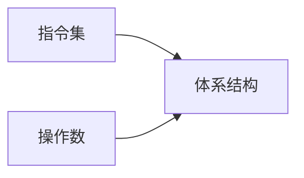
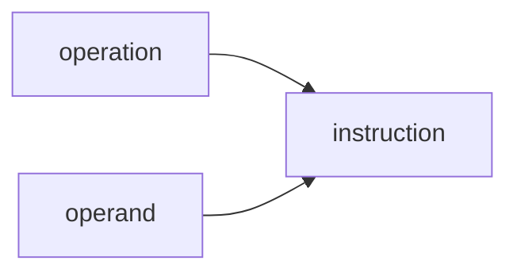
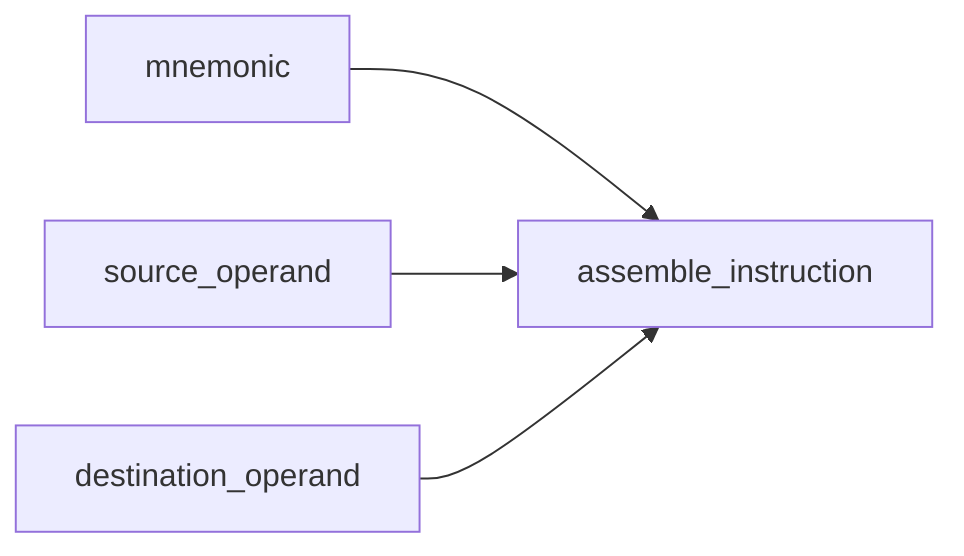
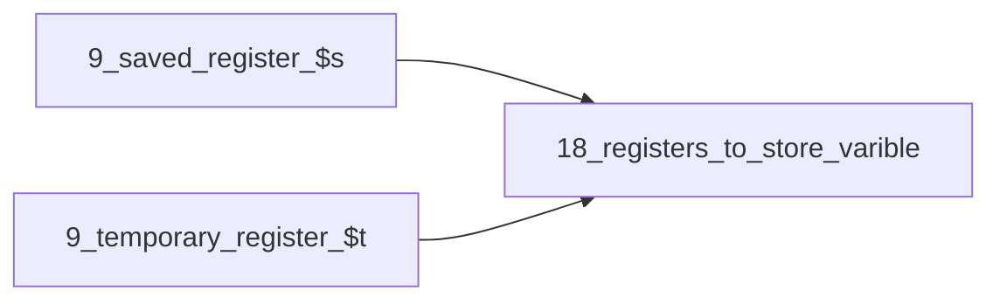
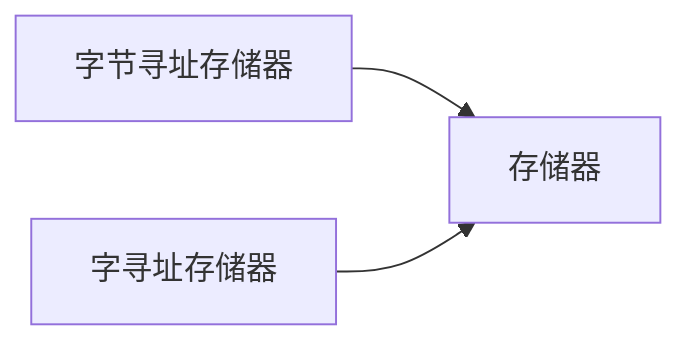
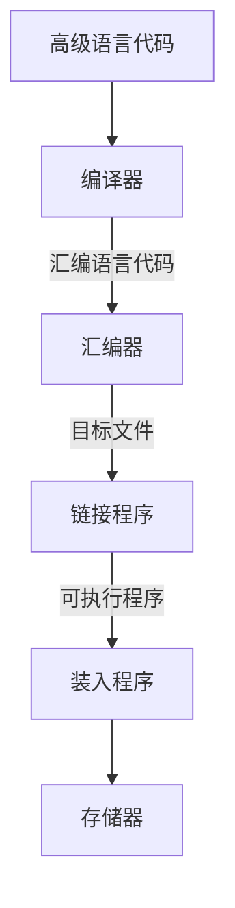

```toc

```

[Intel-video](https://www.youtube.com/watch?v=o_WXTRS2qTY&list=RDCMUC_9tBCeHdBG13If451X7FRw&index=2)


## 体系结构





MIPS（RISC）体系结构设计的4个准则
1. 简单设计有助于规整化
2. 加快常见功能
3. 越小的设计越快
4. 好的设计需要折中的方法

Assemble Language


体系结构会定义几个寄存器用于存放常用的操作数，MIPS有32个寄存器（称为寄存器集 register set 或寄存器文件 register file）通常用小的SRAM阵列实现。使用校译码器和位线连接到相对少的存储单元，所以与大的存储器相比具有更短的**关键路径**
MIPS寄存器名由$ 符号开始，$s0 $s1

![[Pasted image 20221112101410.png]]

### 存储器

MIPS采用字节寻址存储器。每一个字节都有一个单独的地址。

#### 字寻址存储器--Word-addressable
每32位数据对应一个唯一的32位地址

装入字（load word）指令lw将存储器读出的数据装入寄存器中
存储字（store word）指令sw从寄存器向存储器写数据字。

#### 字节寻址
32位的字包含4个8位的字节，每一个字地址都是4的倍数。
MIPS提供了lb和sb指令来装入和存储单字节。

字节寻址存储器的组织方式有大端（big-endian）和小端（little-endian）
最高有效字节（Most Significant Byte，MSB）在左边
最低有效字节（Least Significant Byte，LSB）在右边
大端形式的机器-- 第0字节在最高有效字节
小端形式的机器-- 第0字节在最低有效字节

#### 立即数
常数可以被指令立即访问，而不需要访问寄存器或存储器得到。

### 机器语言

MIPS的三种指令类型：
1. R类型 -- 对3个寄存器操作
2. I类型 -- 对两个寄存器和一个16位的立即数操作
3. J类型 -- 对一个26位的立即数操作

#### R类型指令 -register-type

32位指令包括6个字段：op（6位）、rs、rt、rd、shamt、funct（6位），每个字段包含5-6位
指令的操作编码位两个字段op、funct，所有R类型指令的操作码都是0
指令的操作数编码包括3个字段，rs、rt、rd，前两个是源寄存器，rd是目的寄存器
shamt仅用于移位操作
注意，在汇编语言指令中，目的寄存器是第一个寄存器，而在机器语言指令中，目的寄存器位第三个寄存器字段。

#### I类型指令 immediate-type
I类型指令有两个寄存器和一个16位的立即数

4个字段：op、rs、rt、imm

0扩展，符号扩展：
0扩展应用于逻辑操作，符号扩展用于加减操作

#### J类型指令 jump-type
op(6)+addr(26)

#### 解释机器语言代码
所有的指令都以一个6位的opcode字段开始，如果opcode是0，那么是R类型，否则是I或J类型

#### 存储程序

在MIPS程序中，指令一般从地址0x00400000开始存储
为了运行存储程序，处理器从存储器中顺序地取出指令，然后数字电路硬件解码贺执行这些取出的指令。当前指令的地址存储在一个称为程序计数器（Program Counter，PC）的32位寄存器中。
微处理器的体系结构状态（architectural state）保存程序的状态

### 编程
探讨入好将高级语言转换成MIPS汇编代码
#### 算术/逻辑指令
##### 1.逻辑指令
MIPS逻辑操作包括and、or、xor、nor，使用R类型指令
and指令可用于屏蔽（mask）位
or指令可用于组合来自两个寄存器的位
MIPS不提供NOT指令，但A NOR $0 = NOT A
andi,ori,xori指令也可对立即数进行逻辑操作
##### 2.移位指令
MIPS移位操作包括逻辑左移指令（sll）、逻辑右移指令（srl）和算术右移指令（sra）
左移一般是低位补0，右移可以是逻辑右移（高位补0）或算术右移（高位补符号位）

可变移位指令
sllv，srlv，srav
rt和rs的顺序与一般的R类型指令相反，rt用于保存待移位的值，rs的低5位给出了移位的位数（因为最多移动31/32位嘛）


##### 3.生成常数
addi 用于生成16位常数赋值
#32位常数赋值
为了赋值32位常数，可以先使用一条装入高位立即数指令（lui）,接着用一条OR立即数指令（ori）
##### 4.乘法和除法指令
2个32位数相乘，得到一个64位乘积。2个32位数相除，产生一个32位的商和32位的余数
MIPS体系结构中有两个用于存放乘法和除法结果的特殊用途寄存器，hi和lo。
对应指令为mult和div
MIPS提供mul指令，生成存储在通用寄存器中的32位结果

#### 分支
##### 1. 条件分支
beq bne
当两个寄存器中的值相等时，beq执行分支语句。
当两个值不相等时，bne执行分支语句。

##### 2. 跳转指令
跳转指令（j）
跳转和链接指令（jal）
跳转寄存器指令（jr）

##### 3.条件语句
使用bne和j指令来实现if，if/else，switch/case
##### 4.循环
使用bne和j来组合实现

#### 量值比较
slt指令，小于设置指令，当rs<rt时，slt将rd设置为1，否则为0.

#### 数组

##### 函数调用
1. 函数调用和返回
使用jal指令调用一个函数
使用jr指令从函数返回
2. 输入参数和返回值
$a0 ~ $a3 保存输入参数
$v0 ~ $v1 保存返回值
3. 栈
栈是用于存储函数中局部变量的存储器
栈是后进先出（Last-In-First-Out,LIFO）队列

在执行函数时，首先申请一些栈空间，把会修改的寄存器里的值都放到栈里，再执行函数，函数执行完之后，在从栈中把用到的寄存器的值恢复回去。
函数为自己分配的栈空间称为 #栈帧 
4. 受保护的寄存器
MIPS将寄存器分为受保护（preserved）类型和不受保护（nonpreserved）类型
受保护类型的寄存器：$s0 ~ $s7
不受保护类型的寄存器： $t0 ~ $ t9

当函数A调用函数B时，A是调用函数，B是被调用函数，被调用函数必须保存和恢复它要用到的受保护寄存器。如果被调用函数改变了任何不受保护寄存器，如果调用函数需要其不受保护寄存器的数据不被改变，那么调用函数A在函数调用前，需要保护不受保护的寄存器，二七需要在调用之后恢复这些寄存器。In this case，受保护寄存器可称为**被调用者保存（callee-save）寄存器**，不受保护寄存器称为**调用者保存（caller-save）**

5. 递归函数调用
不用调用其他函数的函数称为叶子（leaf）函数
调用其他函数的函数称为非叶子（nonleaf）函数

递归（recursive）函数

6. 附加参数和局部变量
函数有超过4个的参数和局部变量的话，使用栈存储这些临时数据，前四个参数像往常一样存储在参数寄存器，额外的参数使用栈指针之上的空间保存再栈中

#### 寻址方式（addressing mode）
5种寻址方式：
寄存器寻址，立即数寻址，基地址寻址（定义读/写操作数的模式
PC相对寻址和伪地址寻址（定义写程序计数器PC的方式

#### 编译、汇编和装入
##### MIPS内存映射（memory map）
地址空间为$2^{32}$字节=4GB
地址空间包括四个部分：
1. 代码段（text segment）
2. 全局数据端（global data segment）
3. 动态数据端（dynamic data segment）
4. 保留段（reserved segment）

##### 转换成二进制代码和开始执行程序


 当接触一种新的体系结构的时候，需要提出以下关键问题：
 - 数据字长是多少？
 - 寄存器是什么？
 - 内存是怎样组织的？
 - 指令是什么？

### 微体系结构-mircoarchitecure
微体系结构是将寄存器，ALU，有限状态机、存储器和其他逻辑模块等组合在一起，实现一种体系结构。
#### 设计过程
为体系结构分为两个互相作用的部分，数据路径（datapath）和控制（control）
MIPS是32为体系结构，所以使用32位数据路径

程序计数器（PC）：是一个普通的32位寄存器，他的输出PC指向当前指令，他的输入PC‘指向下一条指令的地址。
指令存储器（instruction memory）：包括32位指令地址输入A，从这个地址读32位指令数据，并传送到读数据输出RD。
寄存器文件：32个单元x32位
数据存储器（data memory）：有读/写端口


###### MIPS微体系结构
3种MIPS处理器体系结构的微体系：单周期、多周期和流水线。
##### 性能分析
$$
指令执行时间=指令数\times (\frac{周期数}{指令})\times(\frac{秒}{周期数})
$$
#### 单周期处理器
**单周期数据路径**
single cycle mircoarchitecture,在一个周期种执行一条完整的指令。
**单周期控制**
控制单元基于指令opcode字段（$Instr_{31:26}$）和funct字段$Instr_{5:0}$计算控制信号。
**性能分析**
每条指令需要一个时钟周期，因此CPI=1.
时钟周期是常数，而且必须足够长以满足最慢的指令。

#### 多周期处理器
单周期处理器的3个主要缺点：
1. 需要足够长的周期来完成最慢的指令
2. 需要三个加法器（1个用于ALU，两个用于PC的逻辑），但加法器是相对占用芯片面积的电路
3. 采用独立的指令存储器和数据存储器，在实际系统中不现实
**多周期处理器**通过将指令执行过程分解位多个较短的步骤来解决这些问题
1. 简单指令速度快
2. 处理器只需要一个加法器，在不同的步骤种能复用。
3. 处理器使用一个可以存储指令和数据的组合存储器


#### 流水线处理器
提高数字系统吞吐量
##### 数据路径
读写存储器和寄存器文件、使用ALU通常构成处理器中的最大延迟，选择5个阶段：
1. 取指令（fetch）
2. 译码（Decode）
3. 执行（Execute）
4. 存储器（Memory）
5. 写回（Writeback）
##### 流水线控制
与单周期处理器使用相同的控制信号，控制单元在译码阶段检查指令的opcode和func字段，产生控制信号。
##### 冲突
参考这个blog[冲突](http://t.csdn.cn/sbxKQ)
多条指令同时执行，当一条指令依赖于还没有结束的另一条指令的结果时，将发生冲突。
冲突可以分为数据冲突和控制冲突。
当一条指令试图读取前一条指令还未写回的寄存器时将发生数据冲突。
在取指令时还未确定下一条指令应取的地址时将发生控制冲突。
##### 性能分析
理想的CPI为1，但是阻塞和刷新会浪费一个周期，所以CPI稍高于1
### 硬件描述语言表示
处理器包括了数据路径和控制器，控制器由主译码器和ALU译码器构成。
#### 单周期处理器
代码在书上P270
### 异常
pass
### 高级微体系结构
程序运行时间正比于时钟周期和每条指令运行所需的周期数（CPI）.
#### 深流水线
提高时钟频率的简单方法就是把流水线划分为更多的阶段，每个阶段包含尽量少的逻辑。
#### 分支预测
分支预测是增加流水线CPI的主要原因。流水线越深，在流水线中解决分支就越晚-->分支错误预测代价越大。
采用动态分支预测器（dynamic branch predictor）
#### 超标量处理器
超标量处理器具有多个数据路径硬件以便支持同时执行多条指令。
#### 乱序处理器
检查多条指令是否可以提交，或者尽可能早地开始执行不相关的指令。
#### 寄存器重命名
乱序处理器受用寄存器重命名的方法消除WAR冲突。
#### 单指令流多数据-Single Instruction Multiple Data（SIMD）
一条指令并行对多个数据片进行操作。
#### 多线程
多线程技术可以在一个程序的指令集并行性比较低或因存储器访问而阻塞时，保持处理器中的多个执行单元处于有效工作状态。
在计算机上运行的程序称为进程（process），每个进程可以包含一个或多个可以同时运行的线程（thread），一个进程拆分成多个并发线程的程度，决定了它的线程级并行性（Thread Leavel Parallelism，TLP）
传统处理器中，多个线程同时运行只是一个假象。实际情况是在操作系统的控制下线程在一个处理器上一次执行，当一个线程结束运行时，操作系统将保存期体系结构状态，加载另一个线程的体系结构转台并开始运行它，这个过程称为上下文切换（context switching），只要处理器能足够快地切换所有线程，用户就会产生多线程同时运行的假象。
多线程处理器不能提高指令级并行性，也不能提高单个线程的性能，多少可以提高处理器的总吞吐量。
#### 同构多处理器（multiprocessor）
多处理器系统包含了多个处理器以及这些处理器之间的通信机制，常用方法是同构多处理技术（homogeneous multiprocessing），又称对称多处理技术（Symmetric MultiProcessing，SMP），其中两个或多个相同的处理器共享同一个主存。
多处理器可以是在多个单独的芯片，也可以是同一个芯片上的多个核。
其他多处理技术：
异构多处理：asymmetric multiprocessor，又称非对称多处理器，使用单独的专用处理器完成特定的任务
集群：（cluster multiprocessing）每个处理器都具有自己的局部存储器系统。集群可以将一组PC通过网络连接起来，运行软件以便解决一个比较大的问题。
#### 异构多处理器
异构多处理器旨在通过整合不同类型的核专用硬件在一个系统里解决同构多处理器增加核不能保证提供持续的性能改进的问题。
每个应用程序使用哪些为其提供最佳性能或最佳功率性能比的计算资源。
所有的核可以使用相同或不同的ISA。
缺点在于增加了系统复杂性。


## 存储器和输入/输出系统
处理器通过存储器接口（memory interface）于存储器系统相连。
时间局部性，空间局部性
时间局部性意味着如果你最近使用了，就有可能再次使用
DRAM和CPU的速度差距越来越大，为了抵消这种趋势，计算机将最常用的指令和数据存储在更快更小的存储器中，这种存储器被称为高速缓存（cache），高速缓存铜川放在与处理器同一芯片的SRAM中。SRAM比DRAM快。
如果处理器需要的数据在高速缓存中可用，那么它可以快速返回，这称为缓存命中（hit）。否则，就从主存DRA,中获得数据，这被称为缓存缺失（miss）.

硬盘负责大量数据存储，使用磁性存储器构建的硬盘驱动（Hard Disk Drive，HDD）。使用闪存技术构建的固态硬盘（solid state drive）
SSD替代HDD成为主流趋势。
#### 存储器系统性能分析
存储器系统性能的度量标准为：“缺失率”(miss rate)，命中率（hit rate），以及平均存储器访问时间（average memory access time）。

### 高速缓存

#### 高速缓存中存放的数据
高速缓存利用时间和空间局部性来实现低缺失率。
时间局部性意味着，如果存储器最近访问过一款数据，那么它可能很快再次访问这块数据。
空间局部性意味着，当处理访问一块数据时，它很可能也访问此存储位置附近的数据，因此当高速缓存从内存中提取一个字的时候，它也可以提取多个相邻的字，这样的一组字被称为高速缓存块（cache block）或高速缓存行（cache line）。
一个高速缓存块中的字数称为块大小（b），容量为C的高速缓存包括了B=C/b块。
#### 高速缓存中的数据查找
一个高速缓存可以组织成S组，其中每一组有一个或者多个数据块。主存中数据的地址和高速缓冲中数据的位置之间的关系称为映射（mapping）
高速缓冲按照组中块的数目进行分类，在直接映射（direct mapped）高速缓存内，每一组只包含一块，所以告诉缓存包含S=B组。在一个特定主存地址映射到高速缓存的唯一块。
在N路组相联（N-way associative）高速缓存中，每一组包含N块。地址依然映射到唯一的组，其中共有S=B/N组。
##### 1. 直接映射高速缓存
因为地址是字对齐的，所以地址的最低两位总是00，紧接着的3位说明存储器地址映射到哪一组。32位地址的最低两位是字节偏移量（byte offset），紧接着的3位称为组位（set bit）说明存储器地址映射到哪一组。
##### 2.多路组相联高速缓存
N路组相联高速缓存通过为每组提供N块的方式来减少冲突（每组只能存储一个数据）
##### 3.全相联高速缓存
全相联高速缓存只有一组，其中包含了B路，（B为块的数目）
##### 4. 块大小
为了利用空间局部性，高速缓存使用更大的块来保存多个连续的字。
块大小大于1个字的优势在于，在发生确实和取出字放入高速缓存中时，在块中相邻的字也会去除放入高速缓存中。
缺点在于较大的块意味着更少的块，可能会导致更多的冲突，增加缺失率。将缺失块装入高速缓存的时间称为缺失代价（miss penalty）
##### 5.小结
高速缓存组织为二维阵列，行称为组，列称为路。阵列中每个表项包括一个数据块、相应的有效位和标志位。
存储器中的每个地址映射到唯一一组，但是它可以存放在此组的任何一路中。
关键参数：
- 容量C
- 块大小b（块数B=C/b)
- 一组内的块数(N)
|组织方式|组数(N)|路数(S)|
|-|-|-|
|直接映射|1|B|
|组相联|1<N<B|B/N|
|全相联|B|1|

#### 数据的替换
在直接映射高速缓存中，每个地址映射到唯一的块和组上。如果当必须装入数据时一个组满了，那么族中的块就必须用新数据替换。
在组相联和全相联的高速缓存中，高速缓存必须在组满时选择哪一个块被替换。
- 时间局部性原则建议最好选择最近最少使用的块。（Least Recently Used,LRU）
#### 高级高速缓存设计
##### 1.多级高速缓存
L1+L2+LN多级缓存，缓存容量逐级增大，速度也变慢
##### 2. 减小缺失率
缺失可以分为**强制缺失、容量缺失、和冲突缺失**
**强制缺失**：对高速缓存块的第一次请求称为强制缺失（compulsory miss）
**容量缺失**：高速缓存太小而不能保存所有并发使用的数据（capacity miss）
**冲突缺失**：当多个地址映射到同一组而被替换的块依然需要时，发生冲突缺失（conflict miss）
增加高速缓存容量可以减少冲突和容量缺失，但不会影响强制缺失
增大块大小可以减少强制缺失（因为空间局部性），但是可能增加冲突缺失（因为更多的地址可能会被映射到同一组中。
对于小型高速缓存来说，增加相联性可以减少冲突缺失。
##### 3.写入策略
高速缓存可以分为直写达和写回两种方式。
直写（write-through）高速缓存中，写入高速缓存块的数据同时写入主存。
写回（write-back）高速缓存中，需要增加以为与每个高速缓存相关联的脏位（D），当写入高速缓存块时，D设为1，其余情况为0。旨在脏高速缓冲块从高速缓存中逐出时，才将他们写回主存。
### 虚拟存储器
计算机中较大的存储器称为虚拟存储器（virtual memory），较小的存储器称为物理存储器（physical memory）
程序使用虚地址（virtual address），指明在虚拟存储器中的位置。物理存储器内保存了虚拟存储器中大部分最近访问过的子集。这样物理存储器充当虚拟存储器的高速缓存。
|高速缓存|虚拟存储器|
|-|-|
|块|页|
|块大小|页大小|
|块偏移量|页偏移量|
|缺失|页面失效|
|标志|虚页号|

虚页可能在物理存储器（DRAM）上，也可能在硬盘上。
根据虚地址确定物理地址的过程称为地址转换（address translation）
如果处理器试图方位不在物理存储器中的虚地址，就会产生页面失效（page fault），操作系统将页从硬盘装入物理存储器中。
虚拟存储器系统使用页表来实现地址转换，对于每个虚页页表都包含一个表项，说明它在物理存储器或硬盘中的位置。
每个装入或者存储指令需要首先访问页表，然后访问物理存储器，页表访问将程序使用的虚地址转换成物理地址，然后使用物理地址进行实际的读或写数据。
转换后备缓冲器（Translation Lookaside Buffer,TLB）缓存了最常用的页表表项

##### 地址转换
虚地址或者物理地址的最高有效位分别说明虚页号或者物理页号，最低有效位说明页内字的位置，也称页偏移量。
##### 页表
处理器使用页表（page table）将虚地址转换为物理地址。
每一个虚页，页表都包含一个表项，表项包括物理页号和有效位，如果有效位为1，则虚页映射到表项指定的物理页，否则虚页在硬盘中.
页表可以存放在物理存储器的任何位置，处理器一般使用称为页表寄存器（page table register）的专用寄存器存放物理存储器中页表的基地址。

##### 转换后备缓冲器
页表访问有很大的时间局部性，很多连续的装入和储存都发生在同一页上，因此，如果处理器能记住它最后读出的页表表项，它就能重用这个转换表项，而不需要重读页表。
##### 存储器保护
现代计算机在同一时间可运行多个程序或进程，所有程序在物理存储器是同时存在的。为了保证在没有得到允许的情况下，没有程序可以访问其他程序的存储空间，需要进行存储器保护。
虚拟存储器系统为每个程序提供自己的虚拟地址空间（virtual address space）
##### 替换策略
虚拟存储器系统使用写回和近似的最近最少使用（LRU）替换策略。
在写回策略下，只有当物理页从物理存储器替换出来时，才写回到硬盘。
每个页表表项包含两个额外的状态位，脏位D和使用位U。
如果任何存储指令修改过物理页，则脏位设置为1.当物理页被换出时，只有在他的脏位为1时，才需要被写回硬盘，否则，硬盘已经有了这一页的正确版本。
如果物理页最近被访问过，那么使用位为1.
##### 多级页表
页表可能会占据大量的物理存储器，为缓解这种情况，可以采用多级页表，把部分页表放到硬盘上。
### I/O简介
一部分的地址空间用于I/O设备而不是内存，这些地址实在存储器映射的保留区域，每一个I/O设备可以指定到这一范围中的一个或者多个地址。对特定地址的存储操作就会将数据发送给该设备。这种I/O设备通信方式称为**内存映射I/O（memory-mapped I/O）**
### 嵌入式I/O系统
嵌入式系统一般围绕着微控制器单元（MCU）来构造。
特殊功能寄存器（special function register，SFR）
#### 通用数字I/O（GPIO）
通用I/O（General-Purpose I/O，GPIO）引脚用于读/写数字信号。
#### 串行I/O
如果MCU要发送比可用GPIO引脚数更多的位，它必须把消息拆分称多个较小的传输。在每个步骤中，它可以发送一位或多位，前者称为串行I/O，后者称为并行I/O。
##### 串行外设接口
（SPI,Serial Peripheral Interface，SPI），是简单的同步串行协议。
物理接口由三个引脚组成：串行时钟（Serial Clock，SCK）、串行数据输出（Serial Data Out，SDO）和串行数据输入（Serial Data In，SDI）。
SPI链接主设备和从设备，主设备生成时钟信号
每个SPI端口与4个32位寄存器相关联：SPIxCON,SPIxSTAT,SPIxBRG,SPIxBUF。
SPI1CON是SPI端口1的控制寄存器，用于启动SPI和设置属性，如传输位数和时钟极性。
STAT是状态寄存器，它指示接受寄存器是否已满。
波特率寄存器（Baud Rate Register）根据下式依据外设时钟设置SCK速率：
$$
f_{SPI} = \frac{f_{peripheral-clock}}{2\times (BRG+1)}
$$

BUF是数据缓冲器，写入BUF的数据通过SDO引脚上的SPI端口传输，SDI引脚所接受的数据可以在传输完成后通过读取BUF得到。
##### 通用异步收发器-UART
UART是两个系统之间不发送时钟信号而进行通信的一种串行I/O外设。
该标准的最初设想是连接数据终端设备（Data Terminal Equipment,DTE）和数据通信设备（Data Communication Equipment,DCE）
奇校验：奇偶位是对数据位进行同或（XNOR）操作的结果。
偶校验：奇偶位是对数据位进行同或（XOR）操作的结果。
UART与5个32位寄存器相关联：UxMODE,UxSTA(状态)，UxBRG，UxTXREG和UxRXREG。
模式寄存器用于配置UART，STA寄存器用于检查数据是否可用，BRG寄存器用于设置波特率。数据通过写入TXREG或读取RXREG来完成发送或接受。
MODE寄存器默认位8位数据位，1位停止位，无奇偶校验和没有RTS/CTS流控制信号
STA寄存器包含使能发送和接受引脚的位，也包含检查发送和接受缓冲器是否已满的位。
16位BRG寄存器用于将波特率设置为外部总线时钟的一部分
$$
f_{UART} = \frac{f_{peripheral-clock}}{16\times (BRG+1)}
$$
#### 计时器
每个计时器与3个16位寄存器相关联：TxCON、TMRx和PRx。
CON是控制寄存器，TMR包含当前时间计数，PR是周期寄存器。
当计时器达到指定时间是，它回到0并设置IFS0中断标志寄存器的TxIF位。程序可以通过查询该位来检测溢出。或者它可以生成一个中断。
#### 中断
定时器通常与中断结合使用，这样程序可以照常运行，并周期性地再计时器产生终端出处理相应的任务。
当硬件事件发生时中断请求出现，每种类型的中断请求都设置中断标志状态（Interrupt Flag Status，IFS）寄存器地特定位。然后处理器检查中断允许控制（Interrupt Enable Control ,IEC）寄存器的相应位。如果该位被设置，MCU通过调用终端服务例程（Interrupt Service Routine，ISR）响应中断请求。
#### 模拟I/O
ADC和DAC的特征由他们的分辨率(N)、动态范围($V_{ref}$)、采样频率($f_s$)和准确度(lsb)来决定。
模拟输入电压$V_{in}(t)$与数字样本$X[n]$之间的关系是：
$$
X[n] = 2^N \frac{V_{in}(t)-V_{{ref}^-}}{V_{{ref}^+}-V_{{ref}^-}}
$$
$$
n=\frac{t}{f_s}
$$
MCU一般不内置DAC，使用脉冲宽度调制（Pulse-Width Modulation，PWM）技术模拟输出。
##### 模拟/数字转换
ADC由许多寄存器控制：AD1CON1-3、AD1CHS、AD1PCFG、AD1CSSL和ADC1BUF0-F
AD1CON1是主控制寄存器，有一个ON位用于启动ADC，一个SAMP位用于合适进行采样和转换，以及一个DONE位指示转换完成。
##### 数字/模拟转换
有些DAC通过具有N条连线的并行接口接受N位数字输入，而另一些则通过串行接口接受数据。
##### 脉冲宽度调制
占空比是脉冲位高电平部分再一个周期中所占的比例。
